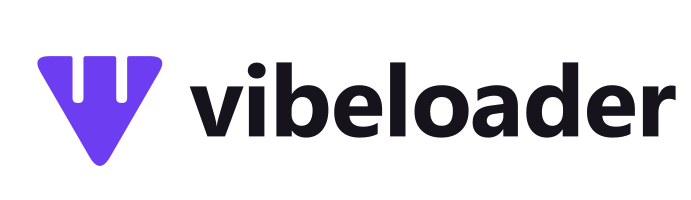

<p align="center">
  
  <br>
  <em>Descarga · Convierte · Disfruta</em>
</p>

<p align="center">
  <a href="brand/BRAND_GUIDELINES.md"><strong>Guía de Marca</strong></a>
</p>

VibeLoader es una aplicación de escritorio para Windows, escrita en Python, para **descargar y comprimir videos y música**. Usa **yt-dlp** para descargar (YouTube, TikTok, Facebook, Instagram, X y más de 1.800 sitios) y **ffmpeg** para convertir.

Tiene dos vistas, que se cambian con el control *Simple | Avanzado* de la cabecera:

- **Simple** (predeterminada): pegar el enlace → elegir *Video* o *Solo audio* → listo. Pensada para quien no quiere pelearse con códecs.
- **Avanzado**: todos los formatos, recortes por tiempo, peso objetivo, subtítulos, sesión del navegador, cola con progreso por descarga y registro detallado.

Funciona bien en una ventana chica (mínimo 720×540): nada necesita maximizar ni hacer scroll.

---

## 🚀 Características

### Simple

Dos botones grandes y un menú:

| Elección | Resultado |
|---|---|
| **Video** | MP4 **hasta 1080p** en H.264 + AAC, sin recomprimir: se reproduce en cualquier TV, celular o reproductor. |
| **Solo audio** | MP3 192 kbps con metadatos y portada. |
| **Más formatos ▾** | *Para el auto (USB)*, *Compatible 720p (sin convertir)* y *WhatsApp*. |

Además: vista previa con miniatura que reserva su lugar (los botones no se mueven), pegado automático desde el portapapeles con aviso para deshacerlo, arrastrar y soltar enlaces, Enter repite la última elección y una franja fija abajo que muestra el progreso, el resultado (*Abrir* / *Ver en carpeta*) o el error con **un botón que lo resuelve** (reintentar, usar tu sesión del navegador, actualizar el motor de descargas, instalar ffmpeg…).

### Avanzado

Los siete formatos:

| Formato | Qué hace |
|---|---|
| **WhatsApp** | H.264 Main@4.0 + AAC, lado largo ≤ 1280 (vertical 720×1280), ≤ 30 fps. Nombre: `id.mp4`. |
| **Máxima calidad** | Igual que *Video* (hasta 1080p, sin recomprimir). |
| **Solo audio (MP3)** | MP3 192 kbps con portada. |
| **Para el auto (USB)** | MP4 para autoestéreos: H.264 **Baseline @ L3.1**, AAC 44.1 kHz, `+faststart`. Nombre: título del video. |
| **Compatible 720p** | 720p H.264 + AAC sin recodificar (cero carga para la CPU). |
| **Cursos (H.265)** | HEVC 720p, CRF 28, AAC 96 kbps, etiqueta `hvc1`. ~40-50 % menos peso que H.264: ideal para cursos y tutoriales largos. |
| **Ajustar a un peso** | Comprime a un **peso objetivo** (16 / 25 / 64 / 100 MB o el que escribas) con dos pasadas; la resolución se ajusta sola al bitrate. |

Las opciones que casi no cambian son **chips** debajo de los campos: punteados si están apagados, rellenos con su valor si están activos (la × los quita). Al hacer clic abren un panel chico:

- **✂ Recortar** por tiempo (`MM:SS`, `HH:MM:SS`, `90s`, `1m30s`), validado contra la duración real. En los formatos que convierten, el corte se hace en la misma pasada de ffmpeg (una sola codificación).
- **Subtítulos** (español / inglés): como `.srt` al lado del video o **incrustados** en el MP4.
- **Sesión del navegador** (Firefox recomendado; Chrome y Edge hay que cerrarlos antes): para videos con restricción de edad o cuando YouTube pide confirmar que no eres un robot.
- **Aceleración**: *GPU automática* usa la tarjeta de video (NVIDIA NVENC, Intel QuickSync o AMD AMF) si funciona de verdad (se prueba, no solo se lista). Si falla, reintenta con CPU. *Solo CPU* da archivos algo más chicos.

Y también:

- **Copia sin recodificar**: si el video descargado ya cumple el perfil (por ejemplo 720p de YouTube para WhatsApp), solo se reempaqueta en segundos.
- **Cola**: es la pestaña principal. Cada descarga muestra su fase (descargando / convirtiendo), porcentaje, velocidad, tiempo restante y su propia ✕. Las terminadas quedan con *Abrir* o *Reintentar* hasta *Vaciar terminados*. *Cancelar todo* detiene la actual y vacía la cola.
- **Listas de reproducción**: al usar un enlace de playlist se abre un diálogo para elegir los videos y el formato; se guardan en una subcarpeta con el nombre de la lista.
- **Pie de estado** con la versión de yt-dlp, si hay ffmpeg y qué tarjeta de video se usa.

### Calidad de vida

- Menú **⋯**: tema (automático como Windows, oscuro o claro), carpetas por formato, actualizar el motor de descargas (también automático una vez al día y sin recompilar el `.exe`), instalar ffmpeg y abrir la carpeta de registros.
- Barra de título del color del tema, progreso en el botón de la barra de tareas y notificación de Windows al terminar si la ventana no está al frente.
- Avisos dentro de la ventana en lugar de diálogos: falta ffmpeg, hay una actualización lista, etc.
- **Historial** con *Volver a descargar*.
- Errores en español claro, sin jerga, cada uno con su acción.
- Limpieza segura: solo se borran archivos temporales **creados por la propia descarga**; nunca archivos que ya tenías en la carpeta.
- Log con fecha y rotación en `%LOCALAPPDATA%\VibeLoader\vibeload.log`.

---

## 🧩 Tecnologías

- **Python 3.10+** y **PySide6** (Qt) para la interfaz.
- **yt-dlp** (con `yt-dlp-ejs` para los retos JavaScript de YouTube y `curl_cffi` para Facebook/Instagram).
- **ffmpeg / ffprobe** para convertir, recortar, unir pistas y analizar archivos.

---

## 📦 Requisitos

1. **Python 3.10 o superior** (solo para desarrollo; el `.exe` no lo necesita).
2. **ffmpeg y ffprobe**: si no los tienes, VibeLoader ofrece descargarlos (≈185 MB, build oficial de BtbN con SHA-256 verificado) a su propia carpeta, sin tocar el sistema. También puedes instalarlos tú y ponerlos en el `PATH`.
3. Opcional para YouTube: un runtime de JavaScript (**Deno** o **Node.js**) mejora la cantidad de formatos disponibles. Sin él, yt-dlp usa clientes alternativos.

---

## 🛠 Instalación (modo desarrollo)

```bash
git clone https://github.com/Cracksmity/vibeload
cd vibeload
python -m venv .venv
.venv\Scripts\activate
pip install -r requirements-dev.txt
python vibeload_whatsapp.py
```

La primera vez se abre un asistente para elegir la carpeta de cada formato.

### Estructura

```
vibeload_whatsapp.py      punto de entrada
vibeloader/
  app.py                  arranque, splash, activa el yt-dlp actualizado
  config.py               constantes y presets
  ytdlp_core.py           descargas, metadatos, subtítulos (yt-dlp)
  ffmpeg_core.py          perfiles, plan copiar/recodificar, hardware, tamaño objetivo
  jobs.py                 núcleo de un trabajo de descarga (sin Qt: avisa por callbacks)
  browsers.py             qué navegador usar para la sesión
  updater.py              actualización de yt-dlp e instalación de ffmpeg
  tools.py · urls.py · utils.py · errors.py · logs.py · settings.py · history.py
  ui/                     vistas, diálogos, estilos, adaptador Qt del núcleo
                          (qt_bridge.py) e integración con Windows
tests/                    pytest
assets/                   ícono y splash (generados por brand/build_playdrop.py)
brand/                    logo Play-Drop: maestros SVG, kit PNG y guía de marca
```

### Tests

```bash
python -m pytest
```

---

## 🧱 Generar el .exe

Doble clic en **`build_vibeload.bat`**. El script:

1. Actualiza las dependencias (`requirements-dev.txt`).
2. Corre los tests y **se detiene si algo falla**.
3. Registra la versión de yt-dlp empaquetada (para el actualizador).
4. Genera `dist\VibeLoader\VibeLoader.exe` con PyInstaller en modo **carpeta** (arranca rápido; no se descomprime en cada inicio).
5. Quita las partes de Qt que la app no usa (`scripts\slim_dist.py`: Qt Quick/QML, Qt PDF, OpenGL por software, traducciones). El build baja de ~140 MB a ~93 MB.
6. Si tienes **Inno Setup** (`winget install JRSoftware.InnoSetup`), crea el instalador `dist\installer\VibeLoader-Setup-<versión>.exe`, que se instala por usuario sin pedir administrador.

El `.exe` no incluye ffmpeg: lo ofrece descargar la primera vez.

---

## 🐛 Problemas comunes

- **"YouTube pide confirmar que no eres un robot" / restricción de edad**: el aviso de error trae el botón *Usar mi sesión de Firefox* (o del navegador que tengas; Chrome y Edge hay que cerrarlos antes). En Avanzado está en el chip *Sesión del navegador*.
- **Error 403 / "Unable to extract"**: el sitio cambió algo. El aviso trae *Actualizar y reintentar*; al reiniciar, el enlace queda listo para volver a intentarlo. También está en ⋯ › *Actualizar el motor de descargas*.
- **Falta ffmpeg**: usa el botón *Instalar ffmpeg* del aviso (o ⋯ › *Instalar ffmpeg*).
- **El formato Cursos falla con "Unknown encoder 'libx265'"**: tu ffmpeg no trae H.265. Usa el que descarga VibeLoader.
- **La conversión por tarjeta de video falla**: VibeLoader reintenta solo con CPU. Si quieres forzarlo, elige el chip *Aceleración* → *Solo CPU*.

---

## 📄 Licencia

Este proyecto está bajo la Licencia MIT. Consulta el archivo [LICENSE](LICENSE) para más detalles.

---

Hecho con Python, una hamburguesa y un toque de vaporwave 🍔🌅
